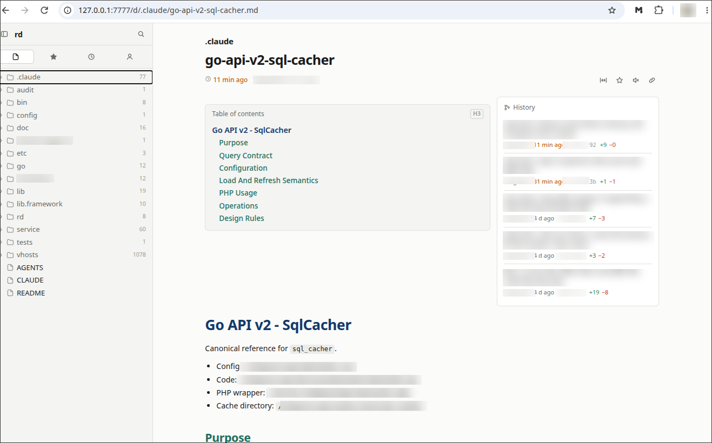
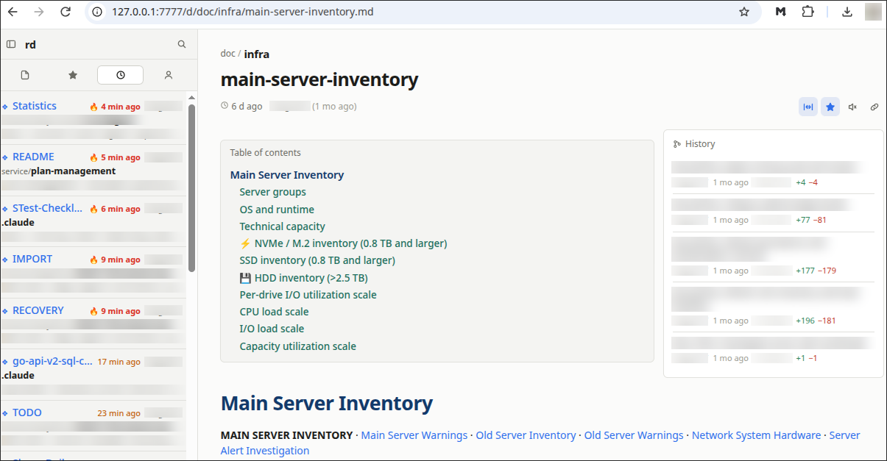

# ❖ mdhouse

**Every Markdown file under a folder, as a fast little website on your own machine.**

> ✦ **In ten seconds.** You have `.md` files scattered across notes, plans and a dozen git
> repos. `mdhouse ~/src` finds all of them, renders them properly, and gives you one browser
> tab with a file tree, instant search, and a live *what changed lately* view fed by git.
> Nothing is imported, indexed into a database or copied anywhere — it reads your folder as
> it is right now, and **never writes to it** unless you ask. So you can point it at
> anything: a shared drive, a colleague's checkout, a directory you only have read access to.

```bash
mdhouse ~/notes
```



It is for people who read and write a lot of Markdown and are tired of `cat`, `less`, and
editor previews that show one file at a time. Made for docs trees and `Plans/` folders; happy
with any directory that has `.md` files in it.

---

## ▸ Try it in a minute

```bash
bun install -g mdhouse      # or: npm install -g mdhouse
```

<details>
<summary>…or run it from a clone</summary>

```bash
git clone https://github.com/parf/mdhouse
cd mdhouse
bun install
sudo ln -sfn "$PWD/bin/mdhouse" /usr/local/bin/mdhouse   # or put bin/ on your PATH
```

</details>

```bash
mdhouse ~/notes                     # one docs tree
mdhouse ~/src                       # a folder full of git repos — all of them at once
mdhouse ~/src ~/notes --port 7777   # several roots, one tab
mdhouse -o                          # the current directory, and open a browser
```

Then open <http://127.0.0.1:7777>. Every document has an address — `/d/<path>/<file>.md` — so
pages can be linked, bookmarked and typed by hand.

No build step, no config file, nothing written into the folder you point it at.

It **runs in the background**, so the terminal comes straight back and the server keeps going
after you close it. When you are done with it:

```bash
mdhouse exit           # stop the one on 7777
mdhouse exit --all     # stop every mdhouse you have running
```

It says so itself on start, so there is nothing to remember. `--fg` keeps it in the foreground
instead, where Ctrl+C stops it. Anything it prints while detached goes to the system log
(`journalctl -t mdhouse`), never to a file of its own.

Run it again somewhere else and it does the obvious thing:

```bash
mdhouse ~/notes        # starts on 7777
mdhouse ~/src          # 7777 is taken — hands ~/src to the one already running
```

The second command does not fail and does not start a rival server: it asks the running
mdhouse to serve that directory too, prints the URL, and exits. Your open tabs keep the tree
they were reading — the new one joins the root switcher beside it. Control goes over a unix
socket at `~/.config/mdhouse/control-<port>.sock`, mode `0600`, so the only thing that can ask
is a process running as you; a web page cannot reach a unix socket at all.

---

## ❖ What you get

**Browse.** A sidebar tree of `.md` and `.mdx` files, nothing else. Three widths — a single
top bar, compact (just navigation), or open (search, tabs and filters) — and `Ctrl+B` cycles
them. Your choice is remembered. Breadcrumbs above a document are clickable.

**Search.** File names match as you type with no request to the server at all. Full text goes
through ripgrep with line numbers and highlighted context, and clicking a hit opens the file
*at that line*. Four chips narrow the results: *names* / *contents* pick which half you see,
*recent* / *mine* restrict them to the same files the Recent and Mine tabs list.

**Recent → Mine.** One list: everything uncommitted in your working tree first, colour-coded
by git status, then the files touched by the last N commits, filterable by committer. Each row
is three lines — file, folder, commit subject — and a `❖` marks the ones that are yours.
*Mine* narrows the list to your own work; all uncommitted changes count as yours.



**A front page.** Click the root name in the sidebar and you get the same material grouped by
**commit** instead of by file: each commit with its subject, its age and the documents it is
the newest change to, in one aligned table. Yours are tinted green and marked `❖`. A commit
that only repeats files you have already seen is dropped, and a tree git knows nothing about
falls back to the twenty most recently changed files.

**The document page.** Above the text: how long ago it changed, who started it and when, an
`N/M done` count when the file has task checkboxes, and buttons to favourite, mute, copy the
link, or trade the comfortable reading column for the full window. Beside it: a table of
contents (H1–H2, with an `H3` chip when the document goes deeper) and a git history panel with
the last five commits to that file — authors, ages, lines added and removed, each row a button
that diffs that commit. `--follow` is used, so a renamed file keeps its history.

**See what changed, two ways.** Beside the star are two buttons. The first shows the file as a
**patch** — green and red, both old and new line numbers, the view everyone already reads diffs
in. The second keeps the **whole document in its markdown styling** and marks the change on it:
new paragraphs, list items and table rows tinted green with a bar in the margin, and deleted
text put back, struck through, exactly where it used to be. Same diff, read as a document
instead of as a patch.

A file with uncommitted work **opens on its diff** — if you have edited it and come back to look
at it, the edit is what you came for — and it opens in whichever of the two views you last used.
A file with nothing outstanding opens as a document and shows the last commit's change when you
ask; click any row in the history panel to see what *that* commit did to this file. (An older
revision is a text the page is not showing, so the marked-up view falls back to the patch and
says why.)

**Ages read like a heat map.** Every "3 h ago" is coloured by how fresh it is: 🔥 for anything
touched in the last ten minutes, then orange for this hour, amber for today, grey for this
week, faint for older. A column of timestamps is legible before you read a single one.

**Mark things.** Favourite a file or a whole folder to keep it in its own tab and on the front
page; mute one to drop it out of Recent. Marks live in `~/.config/mdhouse/`, never inside the
tree you are reading — so they work on a directory you cannot write to at all.

**Renders properly.** CommonMark and GFM through markdown-it: nested lists, tables, footnotes,
task lists, GitHub alerts (`> [!NOTE]`), front matter set aside, syntax highlighting via shiki,
and mermaid diagrams. Relative links and images between documents just work. Light and dark
follow your system.

**Finds your repos.** Hand it a directory of repositories and it discovers each one, listing
files with `git ls-files` so `.gitignore` is honoured with zero configuration. Ignored files
are one toggle (or `--all`) away, not invisible. A folder your own repo ignores — `tmp/`, say —
still lists its files when you point mdhouse straight at it.

**Live.** A WebSocket pushes changes from a filesystem watcher: edit a file in your editor and
the open page, the tree and the front page follow. No polling anywhere. A dot in the sidebar
footer says the connection is up.

Under the hood, every rendered block carries a `data-line` attribute pointing back at its
source line. Nothing uses it yet — it is the foundation for Phase 2.

---

## 🔒 Read-only by default

**mdhouse does not write to the trees it serves.** Point it at anything — someone else's
working checkout, a mounted share, a directory you would rather not touch — and the worst it
can do is read. Pass `--rw` to allow writing; the sidebar then shows a green `RW` beside the
root name. No badge means no writes, which is the normal case.

This is structural, not a matter of care: every write in the codebase goes through one function
that refuses a read-only root. Today nothing calls it — Phase 1 has no feature that writes.

---

## ⌨ Keyboard

| Keys | |
| --- | --- |
| `Ctrl+B` / `⌘B` | cycle the sidebar: bar → compact → open |
| `/`, `Ctrl+K`, `Ctrl+P` | open the sidebar and focus search |
| `Esc` in the search box | clear the query |

---

## ▸ Requirements

- **[Bun](https://bun.sh) ≥ 1.4** — the only hard requirement.
- **git** — optional. Without it you still get the tree and search; recents fall back to
  modification time and the sidebar footer says `no git`.
- **ripgrep** (`rg`) — optional. Without it full-text search uses a slower in-process scan that
  gives the same answers.

---

## ▸ Options

| Flag | Default | |
| --- | --- | --- |
| `-p, --port <n>` | `7777` | one mdhouse per port; a second one hands over its directories |
| `-h, --host <addr>` | `127.0.0.1` | local-only by default; `0.0.0.0` to share on your LAN |
| `-o, --open` | off | open a browser on start |
| `-a, --all` | off | include gitignored `.md` files — with `exit`, stop every mdhouse |
| `-f, --fg` | off | stay in the foreground instead of detaching |
| `--git-log <n>` | `200` | commits scanned for recents and the front page |
| `--no-git` | off | skip git entirely; recents by modification time only |
| `--rw` | off | allow mdhouse to write to the trees it serves |

`MDHOUSE_PORT`, `MDHOUSE_HOST` and `MDHOUSE_ROOT` set the defaults for the port, the bind
address and the directory used when none is given.

A root may also carry a **`.mdhouseignore`**: one directory name per line, `#` for comments,
`!name` to bring back a directory the built-in deny list hides (`node_modules`, `vendor`, build
output and the like).

---

## ▸ Development

```bash
bun install
bun run dev          # serves this repo with hot reload, in the foreground
bun test             # roots & path jail, scanner, renderer, search
bunx tsc --noEmit
```

There is no build step: `Bun.serve` bundles `src/index.html` and everything it imports, so what
you run is what you edited. Mermaid is served separately and only fetched by pages that use it.

The shape of it: `src/cli.ts` (flags) → `src/server.ts` (routes, WebSocket) → `src/lib/` (roots
and the path jail, scanner, renderer, search, git, store, watcher, prefs) → `src/ui/` (Preact).

Planning documents live in [`Plans/PRF-55-md-viewer-web/`](Plans/PRF-55-md-viewer-web/):
[`README.md`](Plans/PRF-55-md-viewer-web/README.md) for how it is built and why,
[`DONE.md`](Plans/PRF-55-md-viewer-web/DONE.md) for a log of everything shipped and how it was
verified, [`TODO.md`](Plans/PRF-55-md-viewer-web/TODO.md) for what is next.

---

## ▸ Status

**Phase 1 is shipped** and in daily use: viewer, search, recents, front page, per-file history
and authorship, per-file diffs, marks, live updates. Read-only end to end.

**Phase 2, in this order:**

- checkboxes you can tick, written back to disk (only with `--rw` — a stale page must never
  corrupt a file)
- a changed / added / removed listing for a whole root, on top of the per-file diffs
- pushing a selected section to Claude or Codex for feedback, streamed back over the WebSocket
  that is already there

If you try it on your own tree and something looks off, an issue with the shape of the
directory is the most useful thing you can send.

Licensed under the **GNU General Public License v2** — see [`LICENSE`](LICENSE).
