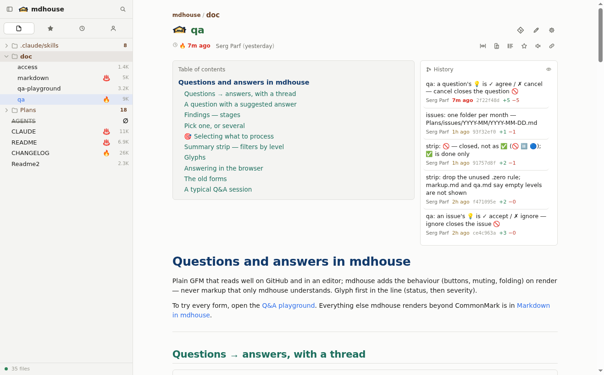
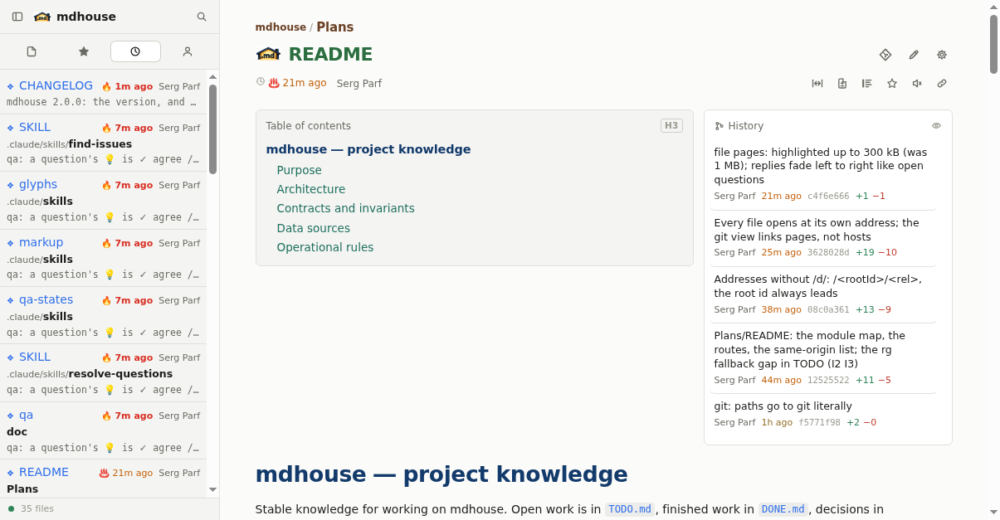
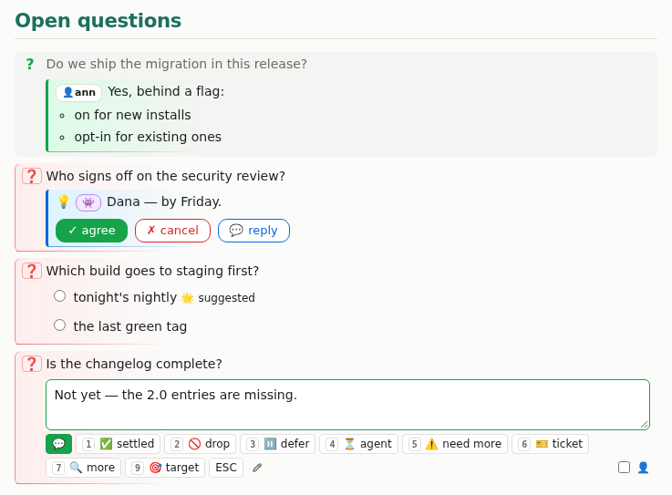
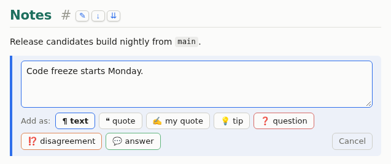

<p align="center">
  
</p>

# ❖ mdhouse

**Every Markdown file under a folder, as a fast little website on your own machine.**

> ✦ **In ten seconds.** Point it at a folder — notes, a repo, a pile of repos — and get one
> browser tab with a file tree, instant search, and a live *what changed lately* view fed by
> git. Nothing is imported, indexed or copied anywhere: it reads the folder as it is right
> now, and never writes to it unless you ask.

```bash
mdhouse ~/notes
```



For people who read and write a lot of Markdown and are tired of `cat`, `less`, and editor
previews that show one file at a time. Made for docs trees and `Plans/` folders; happy with any
directory that has `.md` files in it.

---

## ▸ Install

```bash
bun install -g mdhouse      # or: npm install -g mdhouse
```

On npm: <https://www.npmjs.com/package/mdhouse>

- **[Bun](https://bun.sh) ≥ 1.4** — the only hard requirement, **also when you install with
  npm**: npm installs the package, Bun runs it. Without Bun, `mdhouse` says so and points here.
- **git** — optional. Without it you still get the tree and search; recents fall back to
  modification time and the sidebar footer says `no git`.
- **ripgrep** (`rg`) — optional. Without it full-text search uses a slower in-process scan that
  gives the same answers.

<details>
<summary>…or run it from a clone</summary>

```bash
git clone https://github.com/parf/mdhouse
cd mdhouse
bun install
sudo ln -sfn "$PWD/bin/mdhouse" /usr/local/bin/mdhouse   # or put bin/ on your PATH
```

</details>

## ▸ Start

```bash
mdhouse ~/notes ~/src       # serve these folders — plain notes, a repo, a pile of repos
mdhouse ~/notes ~/src -P    # …and save them, so every later start serves them too
mdhouse                     # the saved folders, or this one when nothing is saved
mdhouse exit                # stop it
```

Then open <http://127.0.0.1:7777>. It runs in the background — the terminal comes straight back
and the server outlives the shell — and running `mdhouse <folder>` again adds that folder to the
one already running rather than starting a rival. More in [Running it](#-running-it).

---

## ❖ What you get

**Browse.** A sidebar tree of `.md` and `.mdx` files, nothing else, in three widths — a single
top bar, compact, or open with search and filters — cycled with `Ctrl+B` and remembered. The
open sidebar shows each file's age and size; compact shows the size. Stubs stand out: a pink
**∅** and a double strike-through under 101 bytes, the size in violet and one strike under 500.
Empty files are left out of the tree. The folders on the way to what you are reading are bold,
git status shows as `M` / `U` / `S` / `D`, and in the open sidebar hovering a file offers ★ and 🔇.

**Search.** File names match as you type, with no request to the server at all. Full text goes
through ripgrep with line numbers and highlighted context, and clicking a hit opens the file
*at that line*. Four chips narrow it: *names* / *contents* pick which half you see, *recent* /
*mine* restrict it to the files the Recent and Mine tabs list.

**Two kinds of recent**, as sidebar tabs — **🕐 Recent**, everything that changed here, and
**👤 Mine**, only your own work (anything uncommitted counts as yours). Uncommitted files come
first, colour-coded by git status, then the files touched by the last N commits, filterable by
committer; `❖` marks the ones that are yours. The other two tabs are **📄 Files** and
**★ Favs**.



**A front page** — the root's name in the sidebar. A band at the top says where the checkout
stands: the branch, when it last pulled, and the commit it is on. Below, what changed, grouped
by **commit**: each with its subject, age, author and the documents it is the newest change to.
Yours are tinted green. **Favs / Recent / Mine** narrow it. A folder git knows nothing about
gets its twenty most recently changed files instead.

**A page per folder.** Click the count on a closed folder in the tree, any folder in a
document's breadcrumb, or **DIR** beside the front page's title, and you get every `.md` beneath
that folder in one table: subfolder, name, age and size. Newest first, or A–Z in `ls -lR` order.
Past 50 files it grows two filters, one per column, that match like `LIKE '%text%'` — `^` and `$`
anchor, `%` and `_` are wildcards. From the root's own page, **GIT** goes back to the front page.

**The document page.** Above the text: a breadcrumb that opens each folder's page, how long ago
the file changed, who started it and when, and an `N/M done` count when it has task checkboxes —
which you can tick, in a folder served with `--rw`: the file is saved with that one line changed.
Beside it: a table of contents (H1–H2, with an `H3` chip when the document goes deeper) and the
last five commits to that file, each a button that shows what that commit did. Renames are
followed, so a moved file keeps its history.

**The buttons above a document**, left to right:

- **↔ Full width** — the whole window instead of a reading column, for wide tables and long
  code lines. It stays on as you move between documents.
- **⊟ Patch** — what changed, as a diff: two line-number gutters, GitHub's green and red, and
  the line content *rendered* — headings, bold, code, links and task boxes look like themselves.
- **▤ Marked-up document** — the same change laid over the whole document in its normal styling:
  new blocks tinted green, deleted text struck through where it used to be.
- **★ Favourite** — pin the file to the Favs tabs.
- **🔇 Mute** — drop it out of Recent without deleting anything.
- **🔗 Copy link** — the document's URL.

A file with uncommitted work opens on its diff, in whichever view you used last; a clean file
opens as a document. Beside the title, **✎** opens the file in your editor through an `edit:`
link (see [Settings](#-settings)).

**Ages read like a heat map** — red under ten minutes, orange this hour, amber today, grey this
week, faint for older — with 🔥 on anything touched in the last ten minutes and ♨️ for the rest
of the hour, in the tree as well as the lists.

**Renders properly.** CommonMark and GFM through markdown-it — everything beyond plain CommonMark
is listed, with live examples, in [**Markdown in mdhouse**](doc/markdown.md). In short: nested lists, tables, footnotes,
task lists, GitHub alerts (`> [!NOTE]`), front matter set aside, syntax highlighting via shiki,
and mermaid diagrams. Question, disagreement and answer blocks — `> [!QUESTION]`, `::: q`,
`**Q:**` lines, `> ?` / `> ?!` / `> 💬`, `- [ ]` / `- ✅` items — have [their own page](doc/qa.md); in a
`--rw` folder you can answer them right on the page. Relative links and images
between documents just work. Light and dark follow your system.

**Finds your repos.** Hand it a directory of repositories and it discovers each one, listing
files with `git ls-files`, so `.gitignore` is honoured with zero configuration. Ignored files
are one toggle (or `--all`) away.

**Live.** Edit a file in your editor and the open page, the tree and the front page follow,
pushed over a WebSocket. No polling; a dot in the sidebar footer says the connection is up.

**Around the edges.** The house in front of every title opens version, links and the shortcut
list (`?` from anywhere). The folder dropdown switches between served folders — more of each
path as the sidebar widens, the whole path with the sidebar off. With the sidebar off, a single
top bar keeps ☰, the dropdown, 🔍 and ⚙.

---

## ✎ Editing docs & answering / asking questions

Serve a folder with `--rw` (**still in testing** — use it on folders under git) and its
documents take a few small edits right on the page. Each one changes only its own lines, and
is refused if the file changed since the page was loaded; what you typed is kept. Anything
bigger is one click away in your own editor.

**Answer a question.** Every ❓ and ⁉️ is a button. Click it, write the answer — plain Markdown,
bullets welcome — and **Save** (Ctrl+Enter). It is written in the question's own syntax: `> 💬`
under a quote, `> [!ANSWER]` under an alert, `**A:**` under a bold line, `::: a` under a
container. An answered question opens its answer for editing.

**Checkbox and status items are questions too** — `- [ ]`, `- ✅`, `- ⚠️`, `- 🚫` and the like.
**Check & Save** answers and ticks it in one go. [Details](doc/qa.md#checkbox-and-status-items).



**Add under a heading.** Hover a heading: after its `#` come ✎ — open the file at that line in
your editor (`edit:/path:line`) — ↓ add a block right under the heading, and ⇊ add one at the
end of its section. Write it, then pick what it is: ¶ text, ❝ quote, ✍️ my quote (signed with
your git name), 💡 tip, ❓ question, ⁉️ disagreement or 💬 answer — so asking a question is the
same two clicks as answering one.



**Tick a checkbox** and that one line is saved. Esc cancels any editor. Every form, answered and
not, is on the [Q&A playground](doc/qa-playground.md) to try; the syntax is in
[Questions and answers](doc/qa.md).

---

## ▸ Running it

**In the background.** `mdhouse <folder>` detaches and returns; `mdhouse exit` (or `stop`) ends
it, and `exit --all` ends every one you have running. Its output goes to the system log, and
the start message says how to read it here — `journalctl -t mdhouse -f` with journald,
`log stream` on macOS. `--fg` keeps it in the foreground, where Ctrl+C stops it.

**It adds, never replaces.** With one already running on the port, `mdhouse ~/src` hands `~/src`
to it: no error, no rival server, and your open tabs keep the tree they were reading. The
request travels over a `0600` unix socket in `~/.config/mdhouse/`, so only a process running as
you can make it.

**Saved folders, port and host.** `-P` (`--perm`) saves the folders you name; from then on
every start serves them, alongside any you name that time. Give `--port` or `--host` with `-P`
and those are saved too — `mdhouse ~/notes -P --port 8080` — so plain `mdhouse`, `mdhouse exit`
and the service all use them. `mdhouse --rm <folder>` forgets a folder and stops serving it —
though the last one being served stays up until `exit`. It all lives in
`~/.config/mdhouse/prefs.json`, with your favourites and settings.

**As a service** (Linux, systemd):

```bash
mdhouse service install      # starts now and at every login, serving the saved folders
mdhouse service status
mdhouse service uninstall
```

It asks you to save a folder first, and it starts the way a plain `mdhouse` does — the saved
folders, on the saved port and host, and writes only to folders saved with `-P --rw`.
`mdhouse exit` stops it, and systemd leaves it stopped: start it again with
`systemctl --user start mdhouse`. The log is `journalctl --user -u mdhouse -f`;
`loginctl enable-linger $USER` starts it at boot, before you log in. `service install --port <n>`
installs a second, pinned instance as `mdhouse-<n>.service`.

### ⚙ Settings

The **⚙** on each page's title line (in the top bar when the sidebar is off):

- **Directories** — what is served, which folders are saved and which are only for this session,
  and a button to remove one. Adding is done from a terminal, with `-P`.
- **Documents → Edit link** — on by default: the ✎ beside each title, linking to
  `edit:/full/path`. It needs something on your machine that opens `edit:` URLs in your editor;
  turn it off if nothing does.

---

## 🔒 Read-only unless you say, and local

**mdhouse does not write to a folder unless you started it with `--rw`.** Point it at someone
else's checkout, a mounted share, a directory you would rather not touch — the worst it can do is
read. Write access belongs to a folder, not to mdhouse: `mdhouse ~/notes --rw` makes `~/notes`
writable and nothing else, `-P --rw` saves it that way, and saving it again without `--rw`
takes write access away. A writable folder has a green `RW` badge; the Settings page shows which
they are, but write access is only ever granted from a terminal.

> [!WARNING]
> **`--rw` is still in testing.** Writing works and is guarded as described here, but it is new:
> use it on folders under git, where any change is one `git diff` away from being seen or undone.

It writes three things: a ticked checkbox, only that line; an answer saved from the page, only
the answer's lines; and a block added under a heading. The page sends the line and a fingerprint
of what it showed, and the server refuses if the file no longer matches — a stale tab can never
change whatever now sits on that line; it reloads and keeps what you typed. Every write goes
through one function that refuses a read-only folder and resolves symlinks before it decides.
Your favourites, saved folders and settings live in `~/.config/mdhouse/`, never inside a tree.

**It answers only your own machine.** It binds `127.0.0.1` unless you pass `--host`. Requests
addressed to any name other than `localhost`, an IP address, or (with `--host`) this machine's
own hostname are refused — that is what stops a web page from re-pointing its domain at your
machine to read your files. Anything that changes state must come from mdhouse's own page. On a
LAN, reach it by IP address or by this machine's own hostname; other DNS names for the machine
are refused.

---

## ⌨ Keyboard

| Keys | |
| --- | --- |
| `Ctrl+B` / `⌘B` | cycle the sidebar: bar → compact → open |
| `/`, `Ctrl+K`, `Ctrl+P` | open the sidebar and focus search |
| `?` | version, links and this list |
| `Esc` | clear the search query, or close the dialog |

## ▸ Options

| Flag | Default | |
| --- | --- | --- |
| `-p, --port <n>` | `7777` | one mdhouse per port; a second one hands over its folders |
| `-h, --host <addr>` | `127.0.0.1` | `0.0.0.0` to share on your LAN. `-h` is the host, not help |
| `-o, --open` | off | open a browser on start |
| `-a, --all` | off | include gitignored `.md` files — with `exit`, stop every mdhouse |
| `-f, --fg` | off | stay in the foreground instead of detaching |
| `--git-log <n>` | `200` | commits scanned for recents and the front page |
| `--no-git` | off | skip git entirely; recents by modification time only |
| `--rw` | off | **testing** — the folders named may be written: checkbox ticks and answers are saved; with `-P`, saved so |
| `-P, --perm` | off | save the folders, and any `--port` / `--host` given: used on every start |
| `--rm` | off | forget the folders and stop serving them |
| `--help` | | the usage text |

Port and host come from the flag, else `MDHOUSE_PORT` / `MDHOUSE_HOST`, else what `-P` saved,
else `7777` on `127.0.0.1`. `MDHOUSE_ROOT` is the folder used when none is named and none is
saved.

A root may carry a **`.mdhouseignore`**: one directory name per line, `#` for comments, `!name`
to bring back a directory the built-in deny list hides (`node_modules`, `vendor`, build output
and the like).

Addresses: a document is `/d/<root>/<path>/<file>.md` and a folder's page `/d/<root>/<path>/` —
the `<root>/` part only when more than one folder is served — so pages can be linked and
bookmarked.

---

## ▸ Status

**1.2** — in folders served with `--rw` (still in testing) you can tick checkboxes and answer
questions right on the page; everything else is read-only. In daily use. Next:

- a changed / added / removed listing for a whole root, on top of the per-file diffs
- pushing a selected section to Claude or Codex for feedback, streamed back over the WebSocket

What changed in each release: [`CHANGELOG.md`](CHANGELOG.md). If you try it on your own tree and
something looks off, an issue describing the shape of the directory is the most useful thing you
can send.

## ▸ Development

```bash
bun install
bun run dev          # serves this repo with hot reload, in the foreground
bun test
bunx tsc --noEmit
```

No build step: `Bun.serve` bundles `src/index.html` and everything it imports, so what you run is
what you edited. How it is built and why is in
[`Plans/PRF-55-md-viewer-web/`](Plans/PRF-55-md-viewer-web/README.md), with what is next in
[`TODO.md`](Plans/PRF-55-md-viewer-web/TODO.md).

Licensed under the **GNU General Public License v2** — see [`LICENSE`](LICENSE).
