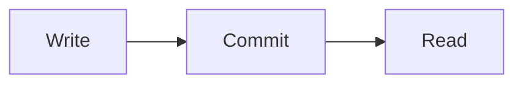

# Markdown in mdhouse

Everything mdhouse renders beyond plain [CommonMark](https://commonmark.org): GitHub Flavored
Markdown, a few widely used plugins, and a handful of mdhouse's own additions. Open this file in
mdhouse and every example below renders live.

| Feature | Syntax | From |
| --- | --- | --- |
| [Tables](#tables) | `\| a \| b \|` | GFM |
| [Task lists](#task-lists) | `- [ ]` / `- [x]` | GFM — **tickable** in mdhouse with `--rw` |
| [Strikethrough](#strikethrough) | `~~text~~` | GFM |
| [Autolinks](#autolinks) | a bare `https://…` | GFM |
| [Footnotes](#footnotes) | `text[^1]` … `[^1]: note` | GFM |
| [Alerts](#alerts) | `> [!NOTE]` `[!TIP]` `[!IMPORTANT]` `[!WARNING]` `[!CAUTION]` | GitHub |
| [Question / Answer alerts](qa.md#question-and-answer-alerts) | `> [!QUESTION]` `> [!ANSWER]` | **mdhouse** |
| [Q&A container blocks](qa.md#container-blocks) | `::: q` / `::: question`, `::: a` / `::: answer` | VuePress / VitePress |
| [Bold `Q:` / `A:` lines](qa.md#bold-lines) | a leading `**Q:**` / `**A:**` | **mdhouse** |
| [Q&A glyphs in a quote](qa.md#glyphs-in-a-quote) | `> ?` `> ?!` `> 💬` `> Q:` `> A:` | **mdhouse** |
| [Checkbox and status items](qa.md#checkbox-and-status-items) | `- [ ]` `- ✅` `- ⚠️` `- 🚫` … as questions | QUESTIONS.md / **mdhouse** |
| [Heading anchors](#heading-anchors) | every heading gets an `id` and a `#` link | markdown-it-anchor |
| [Attributes](#attributes) | `{#id .class}` after a heading or paragraph | markdown-it-attrs |
| [Code highlighting](#code) | ` ```ts ` fences | shiki |
| [Mermaid diagrams](#mermaid) | ` ```mermaid ` fences | Mermaid |
| [Front matter](#front-matter) | a leading `---` YAML block | Jekyll / Hugo convention |
| [Raw HTML](#raw-html) | `<details>`, `<p align="center">`, … | CommonMark |
| [Links between files](#links-and-images) | `[x](../other.md#section)` | mdhouse |

**Not supported** (they render as typed): emoji shortcodes (`:smile:` — type the emoji itself),
`==highlight==`, `H~2~O` subscript, `x^2^` superscript, `$math$`, wiki links (`[[page]]`).

---

## Tables

```markdown
| Plan | Status |
| --- | :---: |
| RLM-1638 | done |
```

| Plan | Status |
| --- | :---: |
| RLM-1638 | done |

## Task lists

```markdown
- [x] scan the tree
- [ ] tick me
```

- [x] scan the tree
- [ ] tick me

The document header counts them (`1/2 done`). In a folder served with `--rw` the boxes are live:
a tick saves `[ ]` ↔ `[x]` on that one line of the file, and is refused if the file changed
since the page was loaded. Elsewhere they are shown, not editable.

## Strikethrough

`~~no longer true~~` → ~~no longer true~~

## Autolinks

A bare address becomes a link: https://bun.sh. Links that leave mdhouse open in a new tab.

## Footnotes

```markdown
A claim that needs a source.[^src]

[^src]: The source.
```

A claim that needs a source.[^src]

[^src]: The source.

## Alerts

GitHub's five, with GitHub's colours. NOTE and TIP are one line — the icon in front of the text,
no "Note" / "Tip" title — while IMPORTANT, WARNING and CAUTION keep a title row, since they are
meant to stop the reader:

```markdown
> [!NOTE]
> Useful information.
```

> [!NOTE]
> Useful information the reader should notice.

> [!TIP]
> Helpful advice.

> [!IMPORTANT]
> Key information.

> [!WARNING]
> Urgent information that needs attention.

> [!CAUTION]
> The risks of an action.

The marker is case-insensitive and must open the quote; the rest of the quote is the alert's
body, and may hold any Markdown.

## Questions and answers

Question, answer and disagreement blocks — `> [!QUESTION]`, `::: q`, `**Q:**` lines, `> ?` /
`> ?!` / `> 💬` — have their own page: [**Questions and answers in mdhouse**](qa.md).

## Heading anchors

Every heading gets an `id` from its text — any language, `## Привет мир` → `#привет-мир` — and a
`#` link beside it. The table of contents and links like `[x](other.md#section)` use the same ids.

## Attributes

`{#id .class}` at the end of a heading or paragraph sets its `id` and classes. Only `id` and
`class` are accepted.

```markdown
## Release notes {#notes}
```

## Code

Fenced blocks are highlighted by shiki, light and dark. Common languages are ready at once; any
other language shiki knows is loaded the first time a document uses it.

```ts
const greet = (name: string) => `hello, ${name}`;
```

## Mermaid

A ` ```mermaid ` fence is drawn as a diagram; the Mermaid library is only loaded by pages that
have one.



## Front matter

A leading `---` YAML block is set aside, not rendered as text. Line numbers — for the marked-up
diff and for ticking boxes — still count it.

## Raw HTML

HTML in a document is rendered: `<details>` and `<summary>` for folding, `<p align="center">` for
centring, `<br>` and the rest. Relative `` inside it is resolved like a Markdown image.

<details>
<summary>Folded</summary>

Markdown inside **still works**.

</details>

## Links and images

- A relative link to another `.md` file opens it inside mdhouse, keeping any `#section`.
- A relative image is served from the folder it lives in.
- A relative link to a text file opens it as plain text — `.txt`, `.log`, `.sql`, `.json`,
  `.yaml`, `.csv`, `.toml`, `.ini`, `.conf`, `.sh`, `.env`, `.mmd` and a few more.
- Links outside mdhouse open in a new tab.

`.mdx` files are listed and rendered as Markdown; their JSX is not executed.
