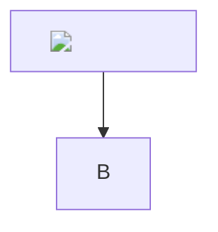

# M05-init-loose

```mermaid
%%{init: {"securityLevel":"loose"}}%%
graph TD
  A["<img src=x onerror=window.__pwned.push('M05')>"]
  A-->B
  click A call pwn()
  click B href "javascript:window.__pwned.push('M05b')"
```
