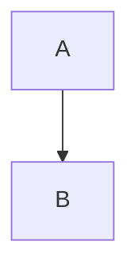

# M19-init-sequence-css

```mermaid
%%{init: {"sequence":{"themeCSS":"body{display:none}"},"flowchart":{"htmlLabels":false}, "themeVariables":{"primaryColor":"red;}body{display:none}/*"}}}%%
graph TD
  A-->B
```
